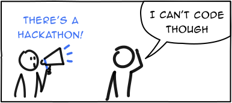

Hackathons are always marketed towards tech folks (Tech, Product, Design, etc.). Basically, the folks who can "Build" stuff. And then, there are B-Plan competitions. Which are primarily marketed towards people who can put up a business plan. This is something that I've observed across the startup industry. 

Rarely I've seen an org which does both in one go. At the core of it, both are programs/events which are conducted to encourage employees to innovate, go out of their comfort zones, challenge the status quo, yada yada yada. 

But, why restrict participation in these events? Why have a hackathon focussed towards people who can "Build" (read it as "Code") and why have a B-Plan competition separately for folks who fit the MBA stereotype? Why not have one focussed session where everyone gets a chance to do something innovative?

Have one event where anyone can innovate. Anyone can collaborate and come up with something. Let engineers team up with marketing folks and put up a business proposal. Let business folks partner with designers and design prototypes.

Innovation can happen in any form. Restricting participation on the basis of employee function is a blocker IMO. And, we challenged this status quo at Razorpay in our annual org-wide hackathon in 2023 July. While I tweeted a summary of it [here](https://twitter.com/ChettyArun/status/1679797218851840001), I want to highlight a few stuff to keep in mind for hackathon organising committees:

* Have two tracks. One where teams present a working demo and the other where teams present a business proposal. Don't just have one track where all the participation is judged under one roof. These two tracks have fundamentally different delivereables. One's delivering working code while the other is delivering a business proposal document. You can't compare apples to oranges. If your judging criteria compares a business proposal with a working code, there's a high chance the working code team will win (because code is ready and a business proposal is just, well, a proposal)
* Have equal prizes for both the tracks. If you allocate a higher prize for one of these tracks, you're by default penalising employees for not having certain skills (If you have a higher prize for a code ready hack, you're telling employees that they're not good if they can't code. Don't celebrate one function over the other)
* Clearly communicate that employees' function has nothing to do with the track they'd want to select. Let engineers select the business proposal track. Let business folks select the working demo track. Be surprised with results when you do this. We were surprised to see HRs and Customer Support folks coding a working demo. We were stoked to see a bunch of engineers and designers putting up a fully researched business proposal

While I can go into a lot of detail and turn this article into a, "How to organise a hackathon?", I'd want to stop here with these basic tips. Feel free to ping me on [Twitter](https://twitter.com/ChettyArun) to discuss this further. 

Hackathons should be events where the entire organisation takes time to go out of their usual daily routine and innovate. An employee's function shouldn't stop them from innovating. Peace out!

_Note: I am refering to internal hackathons when I say, "Hackathons."_

 

---

**Disclaimer:** Hey! These are my unfiltered thoughts, kind of like a stream of consciousness. I'll be honest, I haven't done extensive research. So, take all the information with a grain of salt. It's mostly based on my personal observations and perspectives. 

Hope you enjoyed the read! If you have feedback or a different perspective, I'd love to know. Catch me on [Twitter](https://twitter.com/ChettyArun) or mail me at [me@chettyarun.com](mailto:me@chettyarun.com?Subject=Feedback) Thanks!