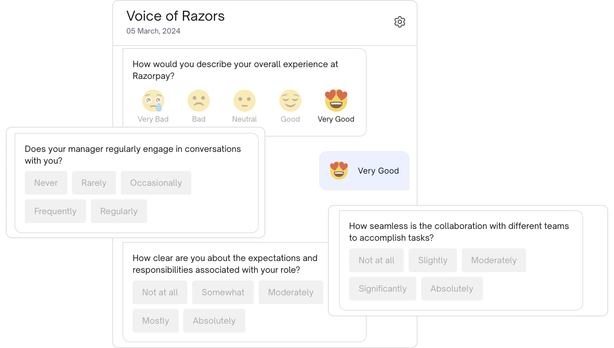
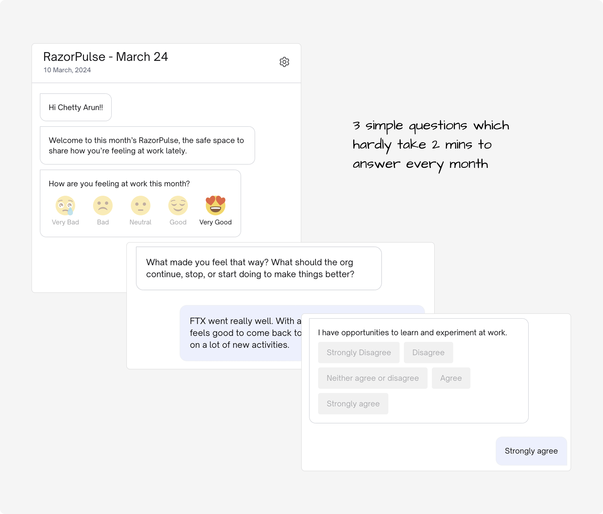

Sometime last year, in February 2024, I launched monthly mood check-in surveys at Razorpay called **RazorPulse**. This is a 2 part series on the Why, What, and How of RazorPulse.

---
 

Historically, Razorpay has always done a bi-annual eNPS survey. This was an elaborate survey with over 50 questions which covered everything from the classic NPS question to RnR, growth opportunities, manager feedback (mNPS), learning & development opportunities, office facilities, employee benefits, compensation benefits, etc. This was (and still is) called Voice of Razors (VoR). 

Voice of Razors was super elaborate. We could identify hotspots in the organization about a certain topic. And, we could dive deeper into these hotspots by doing focus group discussions. And then work with leaders and HR partners in those hotspots to figure out solutions to specific problem statements. For example, if R&R (rewards & recognition) was scoring low in a sales team, we’d do focus group discussions and find out what exactly in R&R was an issue and maybe put up monthly recognition days as a solution. 

Scores from VoR dictated the yearly People Ops strategy planning. Scores like eNPS, mNPS, L&D scores, etc., were L0 OKRs. The data from VoR was used as benchmarks in annual planning. If mNPS was low, we focused on manager development programs. If R&R was low, we focused on central and local R&R initiatives.

While this was good, a bi-annual survey was too late to figure out how the org was doing. There was no immediate way to figure out a monthly trend of how Razors (employees at Razorpay) were feeling at work. And increasing the frequency of VoR wasn’t a viable option as that’s a large survey with over 50 questions. We wanted something quick. Something that employees can fill in without feeling the “Survey Fatigue.” Something that quickly checks in with them and gives leadership a good enough picture of how the employees’ mood is. That’s how **RazorPulse** was born. 

It’s a simple 3-question survey that’s sent in the second week of every month. It’s non-anonymous. It’s non-mandatory. And, it’s quick. 

It has just 3 questions:
1. How are you feeling at work this month? (Pick one from Very Good, Good, Neutral, Bad, and Very Bad)
2. What made you feel that way? (Open text field)
3. A contextual question for that month (usually a Likert scale question)

It’s non-anonymous by design. As this was a monthly check-in, we realised we would get a lot of tactical actionable feedback. Something like, “I feel anxious due to this workload,” or, “With a few personal issues, I don’t feel good this month.” In such cases, we wanted immediate attention & action from leaders and HR partners. So, it was made non-anonymous on purpose and was transparently communicated to the whole org that it was non-anonymous for this reason. 

It’s non-mandatory. We strongly feel that such surveys should be non-mandatory. Once employees trust the system, they willingly participate in such surveys. It’s a positive feedback loop: Employees share their feedback openly, their feedback is acted on promptly, employees see the changes happening, employees trust the system, and thereby employees share their feedback openly. Instead of mandating it, we marketed it well. We explained to folks the why behind this new survey and we let the actions speak for themselves.

It’s designed to be a quick survey. Out of the 3 questions, only the first (the mood question) is mandatory. The remaining 2 are optional. The philosophy I went with was: Employees should be able to fill this survey while they’re on their way to the cafeteria for lunch. It shouldn’t take any more time than that.

The contextual question changed every month. If we did an R&R activity in the org, the question could be a Likert scale regarding the R&R activity. If we were pushing for AI adoption in the org, the third question changed to asking about AI tool facilities. 

Every month, close to 1000 employees (1/3rd of Razorpay) fill the survey. An overall mood score for Razorpay is calculated based on the first question. A team wise mood score (Engineering, Product, Design, Sales, etc., mood scores are calculated and compared to the overall org score). A leaderwise split is made and only the CXOs and business unit heads get access to the exact verbatim shared by employees in the 2nd question. Leaders are then tasked with acting on immediate critical and low-hanging concerns shared by employees. 

This survey: 
Gave leaders a quick health check on how their teams are feeling at work
Gave the HR team and leaders a sense of how People Strategy projects are showing results from the 3rd (contextual) question
Gave leaders action items and not just a quantitative score of eNPS

Leaders at Razorpay take up immediate actions based on what’s said in the survey. I’ve seen employees sharing their quick wins and how they’re feeling elated at work. I’ve seen CXOs taking up skip level meetings with employees multiple levels below them and helping them out because they’ve shared feedback in the pulse survey. Overall, it’s become a forum where employees share feedback without hesitation (in spite of it being a non-anonymous survey) and leaders taking swift action.

The survey comes as a ping on Slack and on Email. It hardly takes 2 minutes to answer. It was very simple to set it up. And, it has shown tremendous results at Razorpay.

In part 2, I’ll share how results from the survey are analysed.

 

---

**Disclaimer:** Hey! These are my unfiltered thoughts, kind of like a stream of consciousness. I'll be honest, I haven't done extensive research. So, take all the information with a grain of salt. It's mostly based on my personal observations and perspectives. 

Hope you enjoyed the read! If you have feedback or a different perspective, I'd love to know. Catch me on [Twitter](https://twitter.com/ChettyArun) or mail me at [me@chettyarun.com](mailto:me@chettyarun.com?Subject=Feedback) Thanks!