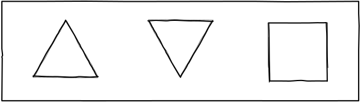
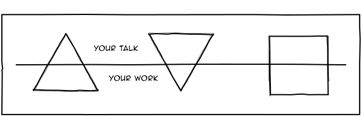
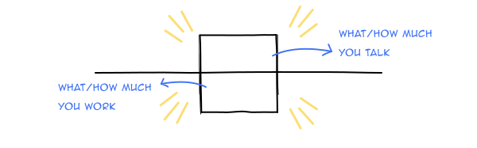

My executive coach once drew these shapes on a board and said I have to be that third square. Before I could put up a puzzled look, he went on to explain something that I now share often with people: 

#### Do more. Talk less
The first triangle represents people who work on a lot of great things but often don't talk much about it (or talk very little about it). You'll find a lot of folks in your organisation like this. A lot of great designers, engineers, business folks, etc., who do absolutely amazing work. But, you rarely see them talk about their work. One possible reason is the hesitation of sharing their work. Talking about your work feels like you're "Boasting". If you're someone like this, start somewhere small. Talk about your work. Blog it, tweet about it, share interesting tidbits to your colleauges at work. Start somewhere. Let the world know how amazing you are and what amazing work you do.

#### Do less. Talk more
The second triangle represents people who talk a lot about their work but often aren't the ones who are great at it. You might've faced people (especially in interviews) who happen to have a great online presence. But, after a conversation or after working with them, you realise they're not that great after all. If you are someone like this, please don't be. 

#### The balance

The third shape, the holy square, is where you should be. You do great work, and you talk about it. You tell the world about your good work, often. That's the balance you have to maintain. If you fall in either of the two triangles, try reaching this ideal shape. 

I wouldn't say I am there at the square yet. I am a little closer to it than I was a few years ago for sure though. I was heading the design team earlier at Razorpay. And, I was interested in the Indian FinTech domain. So, I often asked myself, "If someone were to startup in the FinTech space, would my name come in their top 10 FinTech designers to hire in India list?" This question helped me get closer to being that square. 

Try asking a similar question for your role and your domain. It might help you become a square 🙃

 

---

**Disclaimer:** Hey! These are my unfiltered thoughts, kind of like a stream of consciousness. I'll be honest, I haven't done extensive research. So, take all the information with a grain of salt. It's mostly based on my personal observations and perspectives. 

Hope you enjoyed the read! If you have feedback or a different perspective, I'd love to know. Catch me on [Twitter](https://twitter.com/ChettyArun) or mail me at [me@chettyarun.com](mailto:me@chettyarun.com?Subject=Feedback) Thanks!