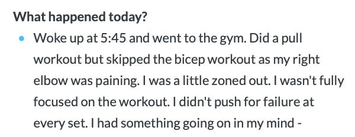
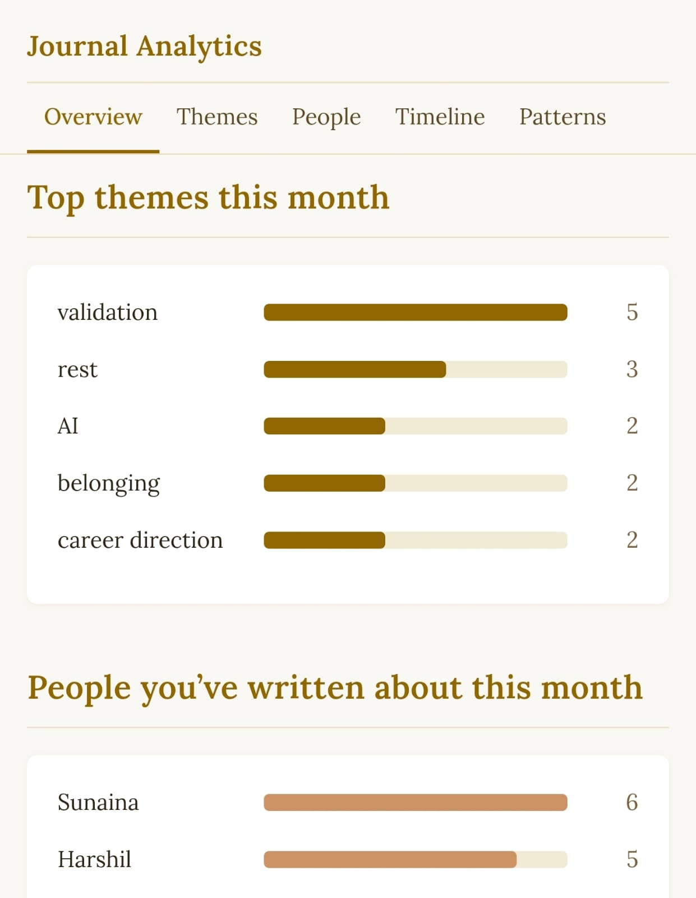
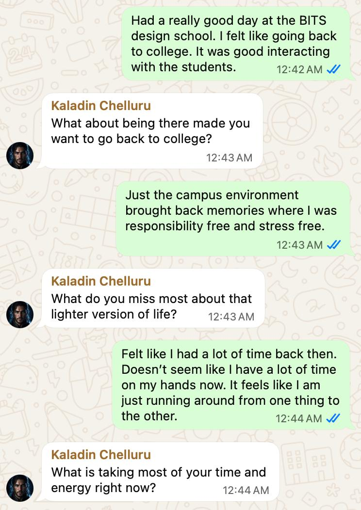

I have journaled for a long time.

For years, I used DayOne. It did its job well: it gave me a place to write things down and maintain a record of my days. But over time I realized that I was mostly logging events, not really understanding them.

That was the limitation.

I could write what happened during the day, what meetings I had, whether I went to the gym, whether I felt distracted, or whether something felt off. But if there was something heavier sitting underneath all that, I usually did not unpack it. I would write a line like "something was on my mind" and move on.

So the journal became an archive, not a tool for reflection.

## The problems I had with normal journaling

The first problem was that the blank page did not help me think.

DayOne is intentionally minimal, and that works if you already know what you want to say. But when your thoughts are fuzzy, or when you are avoiding a feeling without realizing it, the blank page does not push back. It accepts whatever you give it.

The second problem was that I found it easier to describe events than emotions.

I could write that I had a strange day, that I was not focused, or that something was bothering me. But actually naming what I was feeling, and why, took more effort. Most of the time, I stopped before getting there.

  

The third problem was insight.

I used to revisit old entries from one year ago, two years ago, sometimes even older. That was useful for memory, but not for understanding patterns. I could see what happened on a day. I could not easily see recurring emotional themes, unresolved loops, or connections between entries.

I did try manual tagging with things like #happy, #sad, and #anxious. That helped a little, but it was still manual and inconsistent. It also did nothing to improve the quality of reflection while I was actually journaling.

## What I wanted instead

I wanted journaling to feel more like a guided conversation.

Not advice. Not an AI trying to fix my life. Not a chatbot pretending to be wise.

I wanted something that could notice when I was being vague, ask a better question, and help me go one level deeper. As an executive coach, this idea felt obvious to me. Good coaching is often about questions, not answers. So I started wondering what would happen if my OpenClaw setup could bring that same style into journaling.

That is how Sazed took shape.

## Why Sazed?

The name comes from the Cosmere.

Sazed is one of those characters who feels calm, thoughtful, and deeply oriented toward knowledge, memory, and meaning. That felt like the right personality for a journaling system. I did not want an agent that sounded clever or intrusive. I wanted one that could hold context, stay measured, and ask good questions.

That is the role Sazed plays.

## How I set up journaling with OpenClaw

Sazed is one of my OpenClaw agents, and his role is very narrow by design.

He behaves like a professional life coach in the way he asks questions, but he does not give advice. He does not jump to solutions. He only asks probing follow-up questions and logs what I am thinking and feeling.

That boundary matters.

A lot of AI products try to be useful by becoming prescriptive too early. I did not want that here. In journaling, I have found that advice is often less useful than better reflection. So I designed Sazed to stay in question mode.

The workflow is simple. I start journaling in natural language. Sazed reads what I write, notices where I am broad, incomplete, or emotionally vague, and then asks the next question.

If I write something like, "I had something going on in my mind," he does not accept that as a complete thought. He might ask, "What specifically was occupying your mind during the workout, and what feels most important about that right now?"

If I then answer, "Maybe work was on my mind," he can probe further with, "What about work feels most present or unresolved for you right now?"

That turns journaling from a monologue into a guided conversation.

## The graph layer with Kuzu

The second important part of the setup is memory.

Sazed automatically tags journals and feelings, so I am no longer doing that manually. Underneath that, I use Kuzu as the graph database. This allows the system to maintain relationships between entries, emotions, people, topics, and recurring themes across time.

That changes the shape of the journal completely.

Instead of everything being stored as isolated dated notes, the entries become connected. I can revisit my journaling not just by day, but through the things that matter: feelings I mentioned repeatedly, people who show up often, common nouns, recurring topics, and links between moments that would otherwise stay buried.

  

There is also a private page that lets me browse this more easily. The important point is not the access layer itself. The real value is that I can move through my journal using connections instead of only chronology.

That is where the graph structure becomes useful.

## Examples of how the conversation changes

Here is the kind of difference I mean.

In my old journaling flow, I might write a factual entry about my day and end it with a vague line like "something was on my mind." That would be the end of it. The journal would contain the sentence, but it would not help me unpack it.

With Sazed, that same moment becomes the beginning of the reflection, not the end.

He responds with a question like: "What specifically was occupying your mind during the workout, and what feels most important about that right now?"

If I respond with: "Maybe work was on my mind," the next question becomes: "What about work feels most present or unresolved for you right now?"

That sequence is simple, but it does something important. It forces me to move from a vague emotional signal to an identifiable concern.

Another example came from a journal exchange about visiting the BITS design school. I wrote that I had a really good day there, that it made me feel like going back to college, and that I enjoyed interacting with the students.

A blank journal could have stopped there.

Sazed asked: "What about being there made you want to go back to college?"

I answered that the campus environment brought back memories of a time when I felt responsibility-free and stress-free.

Then came the next question: "What do you miss most about that lighter version of life?"

I responded that it felt like I had much more time back then, and that now I often feel like I am just running from one thing to another.

The next question was: "What is taking most of your time and energy right now?"

  

<small><em>Hoid never speaks directly. He sends it to Kaladin and Kaladin sends it back to me. That is why you see Kaladin's name in the chat.</em></small>

That is the difference in one sequence.

The journal entry starts with nostalgia about a campus visit, but the guided conversation surfaces something more useful underneath it: time scarcity, pressure, and the feeling of constant motion. That is much more valuable to revisit later than a simple record that I had a nice day.

## Why this works better for me

I still think blank-canvas journaling works for many people. It worked for me too, up to a point.

But I wanted something more structured without becoming rigid. I wanted journaling to stay conversational and natural while becoming more useful for reflection and retrieval. OpenClaw gave me the right primitives to design exactly that kind of system, and Kuzu gave me a way to preserve relationships between thoughts over time.

So now my journal is not just a daily log.

It is a guided conversation with memory.

That is the real upgrade.

 

---

**Disclaimer:** Hey! These are my unfiltered thoughts, kind of like a stream of consciousness. I'll be honest, I haven't done extensive research. So, take all the information with a grain of salt. It's mostly based on my personal observations and perspectives. 

Hope you enjoyed the read! If you have feedback or a different perspective, I'd love to know. Catch me on [Twitter](https://twitter.com/ChettyArun) or mail me at [me@chettyarun.com](mailto:me@chettyarun.com?Subject=Feedback) Thanks!

*The thoughts are Chetty Arun's, but he used [Hoid](/posts/introducing-hoid/) , his blog writing agent, to shape and publish this post.*

